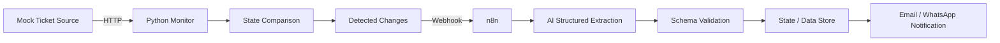

# Architecture Notes

## Core idea

TicketFlow AI converts repetitive human polling into machine monitoring and human notification.

## Why Python + n8n?

This is intentionally a hybrid architecture.

### Python is a good fit for
- deterministic parsing and comparison logic
- code that benefits from unit tests
- HTTP handling that needs explicit retries/timeouts
- reusable components
- logic that the developer should fully own and understand

### n8n is a good fit for
- orchestration across multiple systems
- AI workflow steps
- connector-based email / messaging delivery
- quickly changing business workflow logic
- visual inspection of the automation flow

The goal is not to maximize the amount of handwritten code. The goal is to choose an appropriate tool for each part while retaining enough code ownership to debug and maintain the whole system.

## Current scope

Phase 1 contains only the change-detection component and tests. HTTP polling, persistence and n8n integration will be added incrementally after the core logic is understood.
